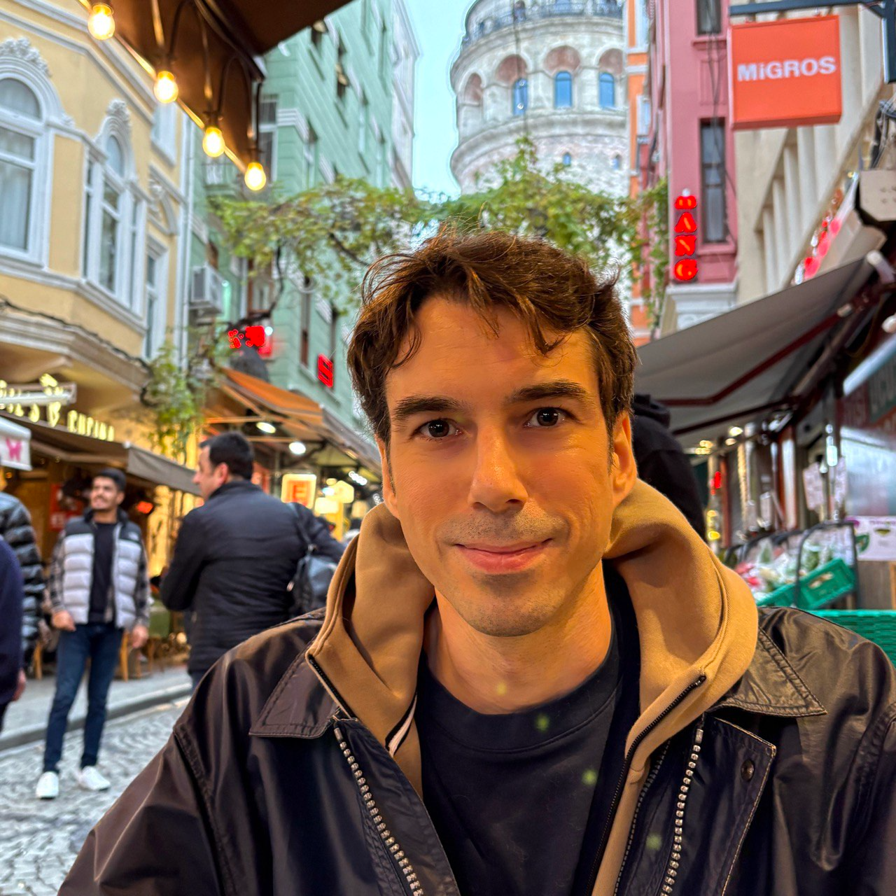

@def title = "Home"
@def tags = ["syntax", "code"]

## Home

~~~

~~~

> *All things are possible,*
>  *perhaps nothing is certain,*
>  *but some things are more likely than others.*

I am a [CNRS] researcher (HDR) at [Université
Côte d’Azur][UCA], a [3IA Côte d'Azur][3IA] Chair and a member of the [COATI
Project-Team][COATI] between [INRIA] and [I3S][I3S].

~~~

<a itemprop="sameAs" content="https://orcid.org/0000-0002-8755-3892" href="https://orcid.org/0000-0002-8755-3892" target="orcid.widget" rel="me noopener noreferrer" >https://orcid.org/0000-0002-8755-3892</a>

 
~~~

### About me

Before accepting a CNRS position in 2018, I've been a fellow of the [*Simons Institute for the Theory of Computing*](https://simons.berkeley.edu/) in the Brain and Computation Program and a postdoctoral fellow at the [*Max Planck Institute for Informatics*](https://www.mpi-inf.mpg.de/departments/algorithms-complexity).
In 2019, I've received the *Best Italian Young Researcher in Theoretical Computer Science* award by the Italian Chapter of the European Association of Theoretical Computer Science, from which I also received the *Best PhD Thesis in Theoretical Computer Science* in 2017. In 2016, I've been a recipient of the *Best Student Paper Award* at the European Symposium on Algorithms.
For more information (projects, academic service etc.), see my [CV](/cv/).

### Research

I'm interested in machine learning and neuroscience, with a focus on theoretical aspects of multi-agent systems and artificial neural networks.
I give a quick overview of my research [here](/research/#research_bio).

<!--
### News
 -->

[3IA]: https://3ia.univ-cotedazur.eu/
[UCA]: http://univ-cotedazur.fr
[COATI]: https://team.inria.fr/coati/team-members
[I3S]: http://www.i3s.unice.fr
[CNRS]: https://www.cnrs.fr/
[INRIA]: https://www.inria.fr/en/inria-centre-universite-cote-azur
