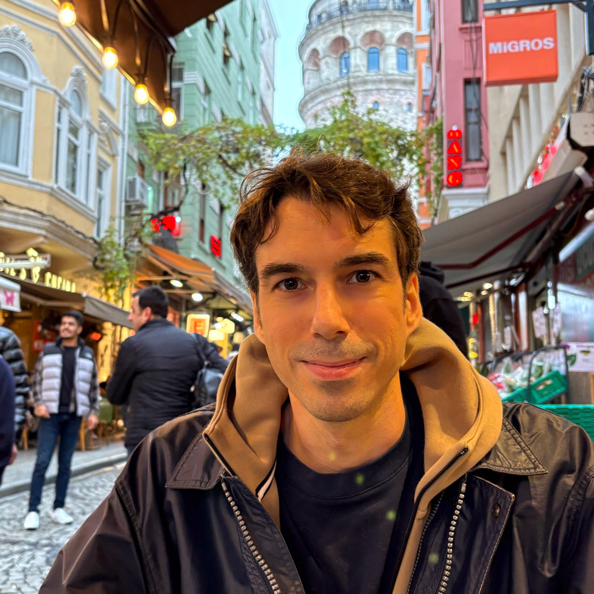

@def title = "Home"
@def tags = ["syntax", "code"]

### Research

I study fundamental mathematical and algorithmic aspects of intelligent systems, such as the efficiency of neural network sparsification and quantization, graph neural networks and transformer-based neural solvers, the robustness of multi-agent computation, and brain-inspired models of intelligence.  
My work spans machine learning, computational neuroscience and multi-agent systems. 
One of my recent substantial contributions is a research program on when large neural networks contain sparse subnetworks that preserve target behavior.
This work connects the expressive limits of pruning, approximation guarantees, structured architectures, and quantization.
The goal is to understand which compression methods preserve capability and which impose fundamental costs. I give a quick overview of my contributions [here](/research/#research_bio).

### About me

~~~

~~~

I am a [CNRS] researcher (HDR) at [Université Côte d'Azur][UCA], a [3IA Côte d'Azur][3IA] Chair, a member of the [COATI Project-Team][COATI] between [INRIA] and [I3S][I3S], and the coordinator of the [ELECTRON Associated INRIA Team](https://team.inria.fr/electron/) with King's College London.
Currently, I am a long-term visitor in Prof. Petra Mutzel's group at [University of Bonn](https://www.informatik.uni-bonn.de/en/) and a member of the [Lamarr Institute](https://lamarr-institute.org/).

~~~

<a itemprop="sameAs" content="https://orcid.org/0000-0002-8755-3892" href="https://orcid.org/0000-0002-8755-3892" target="orcid.widget" rel="me noopener noreferrer" >https://orcid.org/0000-0002-8755-3892</a>

 
~~~

### Short Bio

Before accepting a CNRS position in 2018, I've been a fellow of the [*Simons Institute for the Theory of Computing*](https://simons.berkeley.edu/) in the Brain and Computation Program and a postdoctoral fellow at the [*Max Planck Institute for Informatics*](https://www.mpi-inf.mpg.de/departments/algorithms-complexity).
In 2019, I've received the *Best Italian Young Researcher in Theoretical Computer Science* award by the Italian Chapter of the European Association of Theoretical Computer Science, from which I also received the *Best PhD Thesis in Theoretical Computer Science* in 2017. In 2016, I've been a recipient of the *Best Student Paper Award* at the European Symposium on Algorithms.
For more information (projects, academic service etc.), see my [CV](/cv/).

[3IA]: https://3ia.univ-cotedazur.eu/
[UCA]: http://univ-cotedazur.fr
[COATI]: https://team.inria.fr/coati/team-members
[I3S]: http://www.i3s.unice.fr
[CNRS]: https://www.cnrs.fr/
[INRIA]: https://www.inria.fr/en/inria-centre-universite-cote-azur
